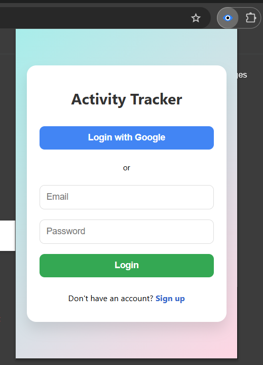
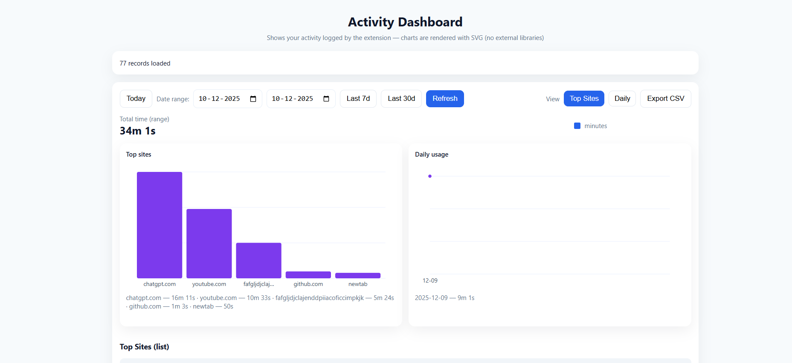

# 🌟 Activity Tracker – Chrome Extension

A powerful Chrome Extension that tracks how long users spend on websites and displays beautiful analytics — built with React, Node.js, MongoDB, and JWT authentication.

---

## 🔰 Badges


---

# 📚 Table of Contents
- Features
- Screenshots
- Installation
- Usage
- API Endpoints
- Project Structure
- Environment Variables
- Roadmap
- FAQ
- Author
- License

---

# 🚀 Features
- ⏱️ Track time spent on each website  
- 🔐 Secure login with JWT  
- 🔑 Google OAuth authentication  
- 📊 Analytics dashboard with charts  
- 🔄 Real-time syncing with backend  
- 🔔 Tracks active tab + time spent  

---

# 🖼️ Screenshots  


### Extension Popup  


### Dashboard  


---

# 🛠 Installation

## 1️⃣ Clone the Repository  
git clone https://github.com/vaishnavi12345678999/Activity-Tracker-Chrome-Extension.git  
cd Activity-Tracker-Chrome-Extension  

---

## 2️⃣ Backend Setup

Go to backend folder:  
cd backend  

Install dependencies:  
npm install  

Create `.env` file:  
PORT=5000  
MONGO_URI=your_mongo_connection_string  
JWT_SECRET=your_secret_key  
GOOGLE_CLIENT_ID=your_google_client_id  
GOOGLE_CLIENT_SECRET=your_google_client_secret  

Start server:  
npm run dev  
Backend runs at: http://localhost:5000  

---

## 3️⃣ Frontend Setup

Go to frontend:  
cd ../activity-tracker-frontend  

Install dependencies:  
npm install  

Start frontend:  
npm start  
Runs at: http://localhost:3000  

---

## 4️⃣ Install Chrome Extension

1. Open Chrome  
2. Visit chrome://extensions/  
3. Enable Developer Mode  
4. Click **Load Unpacked**  
5. Select the `extension` folder  
6. Extension appears in toolbar  

---

# 🎯 Usage

### Login / Signup  
- Email + password  
- Google OAuth  

### Time Tracking  
- Tracks active tab  
- Logs browsing time  
- Sends usage logs to backend  

### Dashboard  
- See websites visited  
- Total time spent  
- Daily/weekly/monthly analytics  

---

# 🔌 API Endpoints

### Auth  
POST /auth/signup  
POST /auth/login  

### Tracking  
POST /track/add  
GET /track/get  

---

# 📁 Project Structure

activity-tracker/  
│  
├── backend/  
│   ├── server.js  
│   ├── routes/  
│   ├── controllers/  
│   ├── models/  
│   ├── middleware/  
│   └── utils/  
│  
├── activity-tracker-frontend/  
│   ├── src/  
│   └── public/  
│  
├── extension/  
│   ├── popup/  
│   ├── scripts/  
│   ├── background.js  
│   └── manifest.json  
│  
└── images/  

---

# 🔐 Environment Variables

```
PORT=5000
MONGO_URI=
JWT_SECRET=
GOOGLE_CLIENT_ID=
GOOGLE_CLIENT_SECRET=
```

---

# 🗺 Roadmap
- Dark mode  
- Better charts in dashboard  
- Weekly insights  
- Chrome storage syncing  
- Optional block-site feature (future)  

---

# ❓ FAQ

### Why is time not tracking?  
Make sure the extension is pinned and running.

### Dashboard not loading?  
Check backend URL and CORS config.

---

# 👩‍💻 Author  
**Vaishnavi Vaitla**  
Full Stack Developer  
GitHub: https://github.com/vaishnavi12345678999  
LinkedIn: https://www.linkedin.com/in/vaishnavi-vaitla-360a1a225  

---

# 📜 License  
Licensed under the MIT License.

